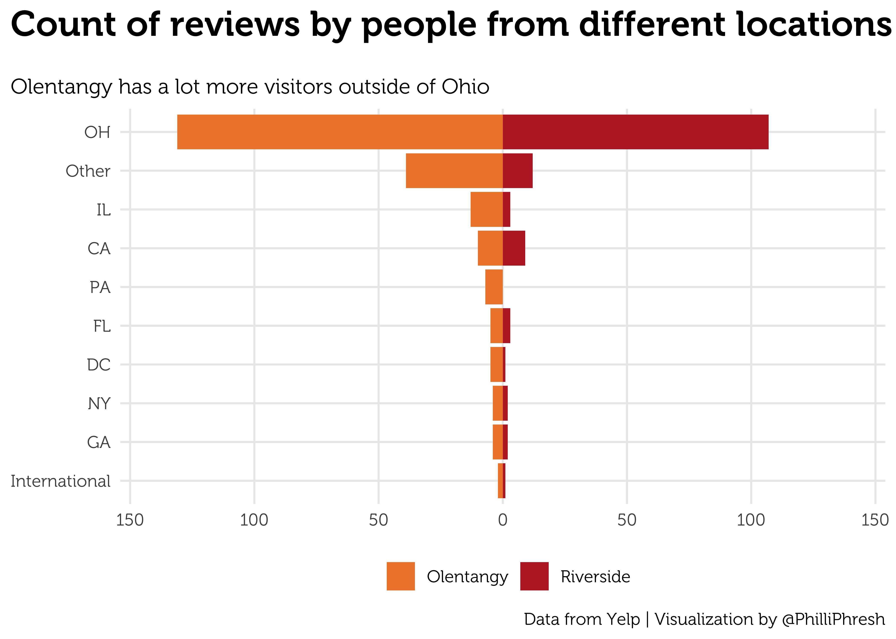
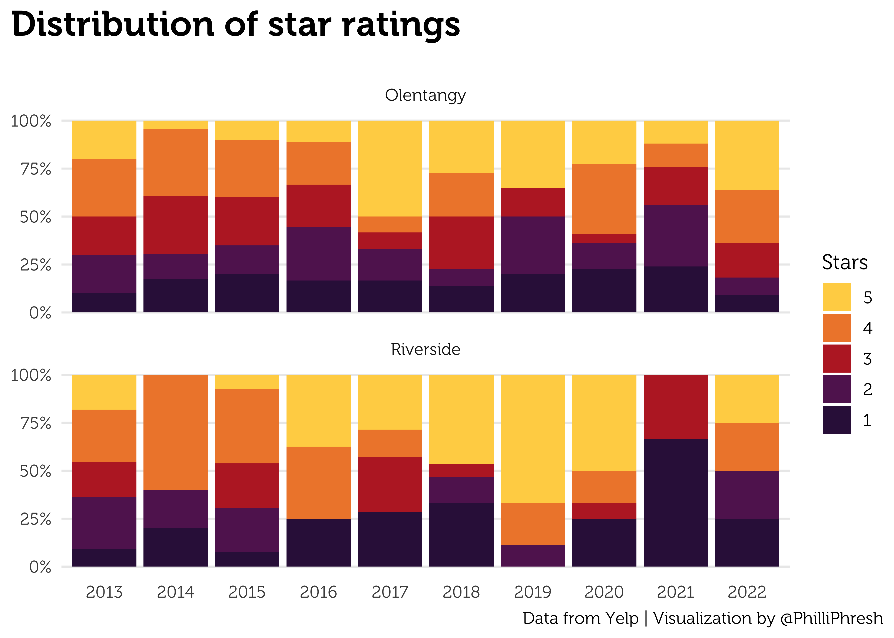
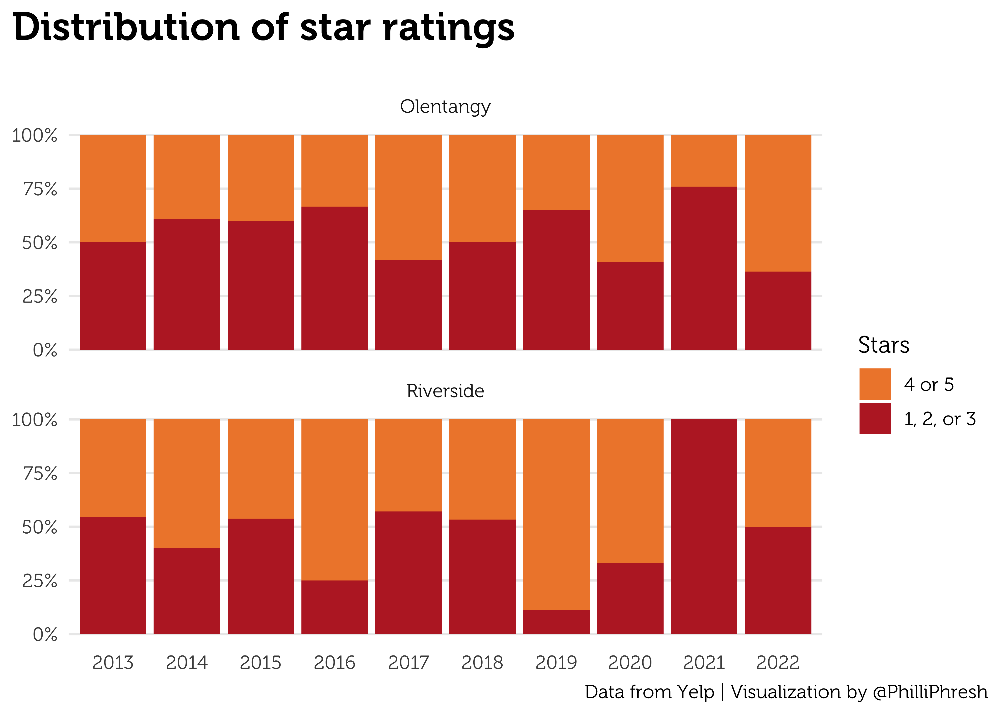
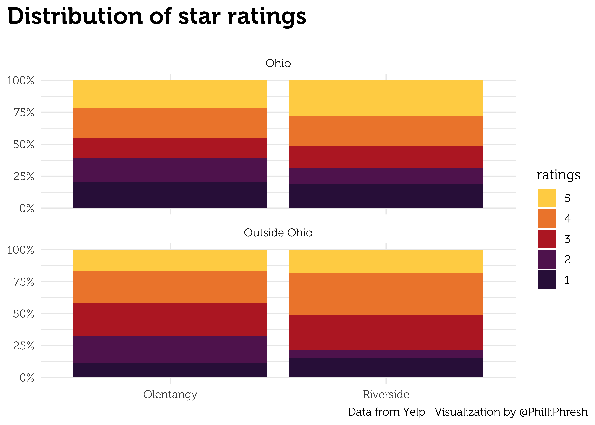

El Vaquero Analysis
================
Phillip Sanderell

## Import Data

Load the scraped review data.

``` r
library(tidyverse)
el_vaq <- read_csv("el vaquero yelp reviews.csv")
```

## Clean Data

``` r
el_vaq <- 
  el_vaq %>% 
  select(-...1) %>% 
  mutate(original_link = link) %>% 
  mutate(link = str_remove(link, "https://www.yelp.com/biz/el-vaquero-mexican-restaurant-columbus-")) %>% 
  mutate(link = str_extract(link, "^\\d+")) %>% 
  mutate(location = case_when(link == 10 ~ "Riverside",
                              link == 15 ~ "Olentangy",
                              TRUE ~ "check")) %>% 
  select(-link) %>% 
  mutate(state_or_country = str_remove(user_locations, "(.*)\\s")) %>% 
  mutate(city = if_else(str_count(user_locations, ",") > 1,
                              str_extract(user_locations, ",\\s(.*),"),
                              str_extract(user_locations, "(.*),"))) %>% 
  mutate(city = str_remove(city, "^,") %>% 
           str_remove(",$") %>% 
           str_trim())
```

## Quick data vizes

Make the vizes pretty

``` r
library(MetBrewer)
showtext::showtext_auto()
showtext::showtext_opts(dpi = 600)
sysfonts::font_add(family = "Museo", 
                   regular = "Museo300-Regular.otf", 
                   bold = "Museo700-Regular.otf")
theme_set(theme_minimal(
  base_family = "Museo",
  base_size = 5
) + 
  theme(plot.title.position = "plot",
        plot.title = element_text(face = "bold", size = 7, 
                             margin = margin(b = 20))))
```

Side-by-side proportional bar plot of ratings distribution

``` r
el_vaq %>% 
  mutate(ratings = fct_reorder(as.factor(ratings), -ratings)) %>% 
  ggplot(aes(x = location, fill = ratings)) +
  geom_bar(position = "fill") +
  labs(title = "Distribution of star ratings",
       x = NULL, y = NULL) +
  scale_y_continuous(labels = scales::label_percent()) +
  scale_fill_manual(values = met.brewer("Tam", 5))
```


``` r
el_vaq %>% 
  mutate(international = state_or_country %in% c("France", "Ireland", "Singapore")) %>% 
  mutate(state_or_country = fct_lump_min(state_or_country, 5)) %>% 
  mutate(state_or_country = if_else(international, 
                                    "International", 
                                    state_or_country %>% as.character())) %>% 
  count(location, state_or_country, sort = TRUE) %>% 
  group_by(location) %>% 
  mutate(state_or_country = fct_reorder(state_or_country, n)) %>% 
  mutate(n = if_else(location == "Olentangy", -n, n)) %>% 
  ggplot(aes(n, state_or_country, fill = location)) +
  geom_col() + 
  labs(title = "Count of reviews by people from different locations",
       y = NULL, x = NULL, fill = NULL,
       subtitle = "Olentangy has a lot more visitors outside of Ohio") +
  scale_x_continuous(limits = c(-140, 140), labels = c("150", "100", "50", "0", "50", "100", "150")) +
  theme(legend.position="bottom") +
  scale_fill_manual(values = met.brewer("Tam", 2))
```



``` r
el_vaq %>% 
  mutate(year = lubridate::year(dates)) %>% 
  filter(year > 2022 - 10) %>% 
  mutate(year = fct_reorder(as.factor(year), year)) %>% 
  mutate(ratings = fct_reorder(as.factor(ratings), -ratings)) %>% 
  ggplot(aes(x = year, fill = ratings)) +
  geom_bar(position = "fill") +
  facet_wrap(~location, ncol = 1) +
  labs(title = "Distribution of star ratings",
       x = NULL, y = NULL) +
  scale_y_continuous(labels = scales::label_percent()) +
  scale_fill_manual(values = met.brewer("Tam", 5))
```



I think it would be easier to read if it was simpler

``` r
el_vaq %>% 
  mutate(year = lubridate::year(dates)) %>% 
  filter(year > 2022 - 10) %>% 
  mutate(year = fct_reorder(as.factor(year), year)) %>% 
  mutate(ratings_simple = if_else(ratings > 3.5, "4 or 5", "1, 2, or 3")) %>% 
  mutate(ratings_simple = fct_reorder(ratings_simple, -ratings)) %>% 
  ggplot(aes(x = year, fill = ratings_simple)) +
  geom_bar(position = "fill") +
  facet_wrap(~location, ncol = 1) +
  labs(title = "Distribution of star ratings",
       x = NULL, y = NULL) +
  scale_y_continuous(labels = scales::label_percent()) +
  scale_fill_manual(values = met.brewer("Tam", 2))
```


``` r
el_vaq %>% 
  mutate(review_location = if_else(state_or_country == "OH", "Ohio",
                                   "Outside Ohio")) %>% 
  mutate(ratings = fct_reorder(as.factor(ratings), -ratings)) %>% 
  ggplot(aes(x = location, fill = ratings)) +
  geom_bar(position = "fill") +
  facet_wrap(~review_location, ncol = 1) +
  labs(title = "Distribution of star ratings",
       x = NULL, y = NULL) +
  scale_y_continuous(labels = scales::label_percent()) +
  scale_fill_manual(values = met.brewer("Tam", 5))
```


It would be cool to see a comparison of ratings for the most popularly
mentioned food items. I could tokenize the ratings, sort by count, and
manualy read through to get maybe the top 10-20 tokens that I recognize
as food. Then with that list of tokens make comparisons between
locations. Potential questions I’m initially thinking include:

- Are the chicken (margs, fajitas, etc.) better at one location than the
  other?

- Are cerain food items more popular in one location than the other?

``` r
library(tidytext)

el_vaq %>% 
  unnest_tokens(word, text) %>% 
  anti_join(stop_words) %>% 
  mutate(word = case_when(word == "taco" ~ "tacos",
                          word == "margarita" ~ "margaritas",
                          TRUE ~ word)) %>% 
  count(word, sort = TRUE)
```

    Joining, by = "word"

    # A tibble: 3,264 × 2
       word           n
       <chr>      <int>
     1 food         408
     2 mexican      254
     3 service      185
     4 el           171
     5 vaquero      128
     6 restaurant   116
     7 salsa        116
     8 time         111
     9 margaritas   107
    10 chips        105
    # … with 3,254 more rows

The top 20 food items mentioned are:

1.  salsa

2.  margaritas/margarita

3.  chips

4.  chicken

5.  cheese

6.  tacos/taco

7.  beans

8.  rice

9.  sauce

10. burrito

11. dip

12. beef

13. queso

14. shrimp

15. fajitas/fajita

16. enchiladas

17. guacamole

18. steak

19. tortillas

20. meat

``` r
most_mentioned_food <-
  c(
    "salsa",
    "margaritas",
    "chips",
    "chicken",
    "cheese",
    "tacos",
    "beans",
    "rice",
    "sauce",
    "burrito",
    "dip",
    "beef",
    "queso",
    "shrimp",
    "fajitas",
    "enchiladas",
    "guacamole",
    "steak",
    "tortillas",
    "meat"
  )

el_vaq %>% 
  unnest_tokens(word, text) %>% 
  anti_join(stop_words, by = "word") %>% 
  mutate(word = case_when(word == "taco" ~ "tacos",
                          word == "margarita" ~ "margaritas",
                          word == "fajita" ~ "fajitas",
                          TRUE ~ word)) %>% 
  filter(word %in% most_mentioned_food) %>% 
  group_by(word, location) %>% 
  summarise(avg_rating = mean(ratings)) %>% 
  group_by(word) %>% 
  mutate(max_rating = max(avg_rating)) %>% 
  mutate(better_location = 
           case_when(avg_rating == max_rating & location == "Riverside" ~ "Riverside",
                     avg_rating == max_rating & location == "Olentangy" ~ "Olentangy",
                     avg_rating != max_rating & location == "Riverside" ~ "Olentangy",
                     avg_rating != max_rating & location == "Olentangy" ~ "Riverside", TRUE ~ "check")) %>% 
  ungroup() %>% 
  mutate(word = fct_reorder(word, max_rating)) %>% 
  ggplot(aes(avg_rating, word)) +
  geom_line(aes(color = better_location), size = 1.5, alpha = .5) +
  geom_point(aes(color = location), size = 4) +
  geom_text(aes(label = word, x = max_rating, y = word),
            hjust = 0, nudge_x = .25, check_overlap = TRUE, size = 1.5,
            family = "Museo") +
  scale_x_continuous(limits = c(0, 5)) +
  theme(legend.position = c(.5 / 5, 20.5 / 22),
        legend.direction = "vertical",
        legend.justification = c(0, 1),
        panel.grid.major.x = element_blank(),
        panel.grid.minor.x = element_blank(),
        panel.grid = element_blank(),
        axis.text.y = element_blank(),
        plot.title = element_text(face = "bold", size = 7, 
                             margin = margin(b = 20))) +
  labs(y = NULL,
       x = "Avgerage Rating (1-5 stars)",
       color = NULL,
       title = "Most mentioned word, sorted by average rating") +
  scale_color_manual(values = met.brewer("Tam", 2)) +
  coord_cartesian(ylim = c(1, 22)) +
  annotate(geom = "text", x = 4.75, y = 22, label = "Reviews mentioning...",
           hjust = 1, fontface = "bold", family = "Museo", size = 1.5)
```

    `summarise()` has grouped output by 'word'. You can override using the
    `.groups` argument.



The top 20 words related to experience mentioned are:

1.  service

2.  time / fast / minutes / times / quick / quickly

3.  pretty

4.  location

5.  staff

6.  table

7.  people

8.  friendly

9.  patio

10. experience

11. server

12. home

13. busy

14. prices

15. night

16. portions

17. spot

18. wait

19. served

20. town

``` r
most_mentioned_experience <-
  c(
    "service",    
    "quick", # used for time / fast / minutes / times / quick / quickly
    "pretty",    "location",
    "staff",    "table",
    "people",    "friendly",
    "patio",    "experience",
    "server",    "home",
    "busy",    "prices",
    "night",    "portions",
    "spot",    "wait",
    "served",    "town"
  )

el_vaq %>% 
  unnest_tokens(word, text) %>% 
  anti_join(stop_words, by = "word") %>% 
  mutate(word = if_else(word %in% c("fast", "minutes", "time", "quick",
                                    "quickly"), "quick", word)) %>% 
  filter(word %in% most_mentioned_experience) %>% 
  group_by(word, location) %>% 
  summarise(avg_rating = mean(ratings), .groups = ) %>% 
  group_by(word) %>% 
  mutate(max_rating = max(avg_rating)) %>% 
  mutate(better_location = 
           case_when(avg_rating == max_rating & location == "Riverside" ~ "Riverside",
                     avg_rating == max_rating & location == "Olentangy" ~ "Olentangy",
                     avg_rating != max_rating & location == "Riverside" ~ "Olentangy",
                     avg_rating != max_rating & location == "Olentangy" ~ "Riverside", TRUE ~ "check")) %>% 
  ungroup() %>% 
  mutate(word = fct_reorder(word, max_rating)) %>% 
  ggplot(aes(avg_rating, word)) +
  geom_line(aes(color = better_location), size = 1.5, alpha = .5) +
  geom_point(aes(color = location), size = 4) +
  geom_text(aes(label = word, x = max_rating, y = word),
            hjust = 0, nudge_x = .25, check_overlap = TRUE, size = 1.5,
            family = "Museo") +
  scale_x_continuous(limits = c(0, 5)) +
  theme(legend.position = c(.5 / 5, 20.5 / 22),
        legend.direction = "vertical",
        legend.justification = c(0, 1),
        panel.grid.major.x = element_blank(),
        panel.grid.minor.x = element_blank(),
        panel.grid = element_blank(),
        axis.text.y = element_blank(),
        plot.title = element_text(face = "bold", size = 7, 
                             margin = margin(b = 20))) +
  labs(y = NULL,
       x = "Avgerage Rating (1-5 stars)",
       color = NULL,
       title = "Most mentioned word, sorted by average rating") +
  scale_color_manual(values = met.brewer("Tam", 2)) +
  coord_cartesian(ylim = c(1, 22)) +
  annotate(geom = "text", x = 4.75, y = 22, label = "Reviews mentioning...",
           hjust = 1, fontface = "bold", family = "Museo", size = 1.5)
```

    `summarise()` has grouped output by 'word'. You can override using the
    `.groups` argument.


